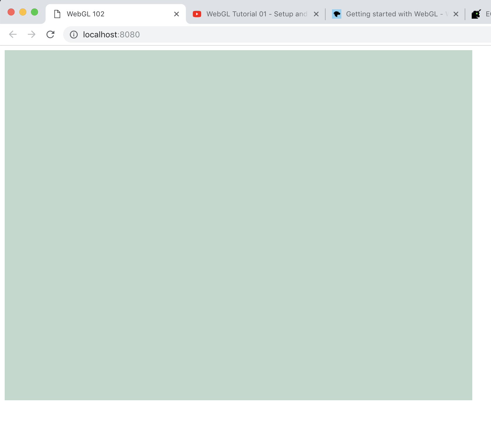

# webgl-102

Learning WebGL with [WebGL Tutorials by Indigo Code](https://www.youtube.com/watch?v=kB0ZVUrI4Aw&list=PLjcVFFANLS5zH_PeKC6I8p0Pt1hzph_rt) on Youtube (highly recommended. really good!)
in combination with [Getting Started with WebGL](https://developer.mozilla.org/en-US/docs/Web/API/WebGL_API/Tutorial/Getting_started_with_WebGL) tutorials on MDN.

Here are my notes during learning.

## Step 0: Set up Project

Unlike in the tutorial, I prefer using TypeScript over JavaScript.
I'm using webpack with `awesome-typescript-loader` to transpile TypeScript
and using `webpack-dev-server` as a local dev server.

I will keep TS source files in `./src` folder, and use `./dist` folder for output files.

Start by install dev-dependencies.

```sh
$ npm install --save-dev \
		typescript \
		awesome-typescript-loader \
		source-map-loader \
		webpack \
		webpack-cli \
		webpack-dev-server
```

Then create `webpack.config.js` file.

```js
const path = require('path');

module.exports = {
	mode: 'development',
	entry: './src/main.ts',
	output: {
		filename: 'main.js',
		path: path.resolve(__dirname, 'dist')
	},
	devServer: {
		contentBase: './src'
	},
	resolve: {
		extensions: ['.ts', '.tsx', '.js', '.jsx']
	},
	devtool: 'source-map',
	module: {
		rules: [
			{
				test: /\.tsx?$/,
				loader: 'awesome-typescript-loader'
			}
		]
	}
};
```

- `devServer.contentBase` - tell webpack-dev-server to serve files from this directory
- `resolve.extensions` - add `.js`, `.jsx` extensions as they are required to load 3rd party modules
- `loader` - use `awesome-typescript-loader` for `.ts` files

Next is to create `tsconfig.json`

```json
{
	"compilerOptions": {
		"allowJs": true,
		"target": "es5",
		"noImplicitAny": true
	}
}
```

Finally, prepare `./src/index.html` with a reference to `main.js` file which does not exist yet,
but webpack-dev-server will take care of it.

```html
<!DOCTYPE html>
<html lang="en">
<head>
	<meta charset="UTF-8">
	<meta name="viewport" content="width=device-width, initial-scale=1.0">
	<meta http-equiv="X-UA-Compatible" content="ie=edge">
	<title>WebGL 102</title>
</head>
<body>
	<script src="main.js"></script>
</body>
</html>
```

Run dev server via `npx`

```
$ npx webpack-dev-server --open
```

The dev URL is at `http://localhost:8080/`.

---

## Step 1: Draw something

WebGL is draw in a `<canvas>` element. So we create it in the HTML page.

```html
<canvas id="webgl-102" width="800" height="600"></canvas>
```

In TS code, get WebGL context from the canvas element.

```ts
const canvas = <HTMLCanvasElement>document.getElementById('webgl-102');
const gl = canvas.getContext('webgl');
```

### Checking if the browser support WebGL

It is also a good idea to handle fallback for older browsers.
On IE11, Edge, and some Android browsers, we have to get the context using `experimental-webgl` instead.

If we still cannot get the context from `experimental-webgl`, then the user is using a browser that doesn't support WebGL.
In this case, we can do nothing but stop continuing.

```ts
let gl = canvas.getContext('webgl');
if (!gl) {
	gl = canvas.getContext('experimental-webgl');
}

if (!gl) {
	console.warn('WebGL is not supported in your browser.');
	return;
}
```

### Drawing the canvas

```ts
gl.clearColor(0.75, 0.85, 0.8, 1);
gl.clear(this.gl.COLOR_BUFFER_BIT | this.gl.DEPTH_BUFFER_BIT);
```

- `.clearColor(R, G, B, A)` - specify the color to use with `.clear()` method. This doesn't draw anything yet. It just sets the color.
- `.clear(mask)` - _clears_ buffers to the preset value. `mask` argument indicates buffers to be cleared. In the code abover, we clear both color buffer and depth buffer.
  - `COLOR_BUFFER_BIT` specifies the color of a pixel
  - `DEPTH_BUFFER_BIT` specifies the depth of a pixel - how far is the pixel.

Refresh the browser, the canvas should be on the screen.



---

## Step 2: Shaders

- A shader is a program that runs on the GPU
- It is written in the OpenGL ES Shading Language (GLSL)
- It needs to be compiled for execution on the GPU
- A Vertex Shader is a shader that takes care of each vertex (each point) in the shape by setting position of the vertext in WebGL coordinates system.
- A Fragment Shader is a shader that is called once for each pixel on the shape by setting the color of the pixel to put on the screen.

An example of a vertex shader

```
precision mediump float;

attribute vec2 vertPosition;

void main() {
	gl_Position = vec4(vertPosition, 0.0, 1.0);
}
```

An example of a fragment shader

```
precision mediump float;

void main() {
	gl_FragColor = vec4(1.0, 0.3, 0.0, 1.0);
}
```

To be continued. For now, see [`app.ts`](./src/app.ts) for inline notes.
