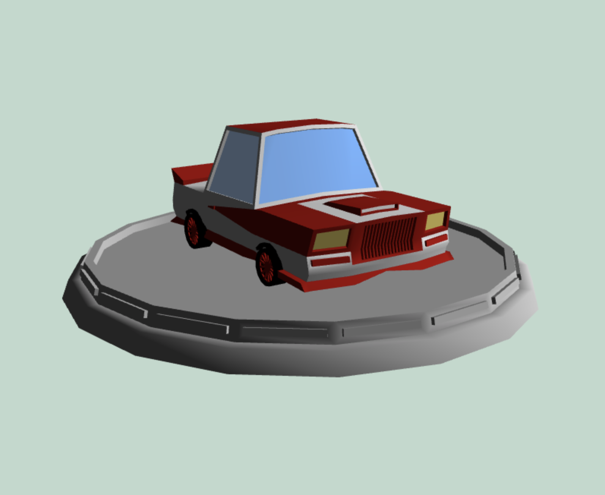

# webgl-102

This branch contains code to draw a car from a 15-meshes model.

Make sure to check the `notes` branch's [readme](https://github.com/armno/webgl-102/blob/notes/readme.md) file for the notes.
